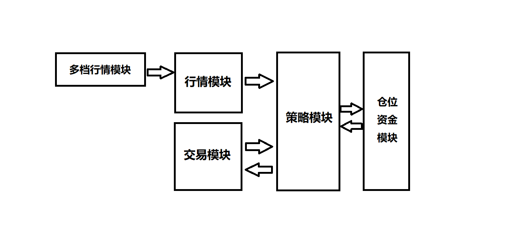

### Poincare介绍

Poincare是一个linux下使用了CTP接口的微型交易系统， 它从诞生起就被赋予了高性能以及高稳定性的使命，吸取了各家的best practice ，精益求精。

------

#### 结构上采用了低耦合的四层设计，行情模块，交易模块，策略模块和仓位资金模块分离：

- 行情模块负责向CTP注册合约， 接收到行情后直接推向策略（不经过交易模块）。另外如果策略希望接收多档行情的话，行情模块会从redis里面取出最新的多档行情拼好后推送（目前支持上期所）
- 交易模块是CTP和策略之间的桥梁，它的重要性不言而喻：
  - 获取账户资金信息，仓位信息，并打包好推给策略
  - 发送策略产生的下单信号到CTP（目前用精确到毫秒的时间差来确保OrderRef的唯一单调递增）
  - 封装整合CTP的 OnRspOrderInsert， OnRspOrderAction， OnRtnOrder， OnRtnTrade回报，将其归一化后推给策略，极大地方便了策略开发，目前有如下几种状态：
    - SIG_STATUS_INIT 订单已经发送，但还没有收到交易所确认
    - SIG_STATUS_SUCCEED 订单完全成交
    - SIG_STATUS_ENTRUSTED 订单得到交易所确认，报单成功
    - SIG_STATUS_PARTED 订单部分成交
    - SIG_STATUS_CANCELED 撤单成功
    - SIG_STATUS_REJECTED 订单被拒
    - SIG_STATUS_CANCEL_REJECTED 撤单被拒，信息填错了或者订单已成交
- 策略模块是产生信号的模块，它包括5个回调函数：
  - my_st_init：策略初始化的地方，包含了账户，资金仓位方面的信息
  - my_on_book：行情的入口，是策略逻辑的主要入口
  - my_on_response：归一化后的回报入口
  - my_on_timer：定时任务的地方，允许策略在指定时间间隔做自己的任务
  - my_destroy：策略结束的地方，程序结束或者coredump的时候都会回调

- 策略模块是产生信号的模块

- 仓位资金模块是一个策略可以选配的模块，它提供一个经过长时间实盘检验过的稳定的仓位资金管理，简化策略开发的难度。另外稳定的智能发单也在考虑接入，可以实现TargetPos以及TWAP/VWAP发单策略

------

#### 代码层次上使用了偏向C风格的C++代码，追求语言的简洁精炼 

使用了精简高性能的容器MyArray和MyHash来替代STL的vector和map，在实测中大概是后者性能的两倍